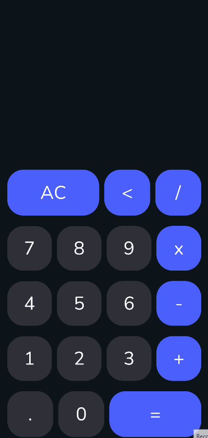

  <h1>
    Calculator 📱
  </h1>
  
  

  <h4>
    
  </h4>

 

<h1>
  Project 💻
</h1>

 This is my first project, I did it with the aim of starting to learn about native Android Development. 

 

<h1>
Technologies 🚀 
</h1>

- Kotlin
- Jetpack Compose
- Android Studio
